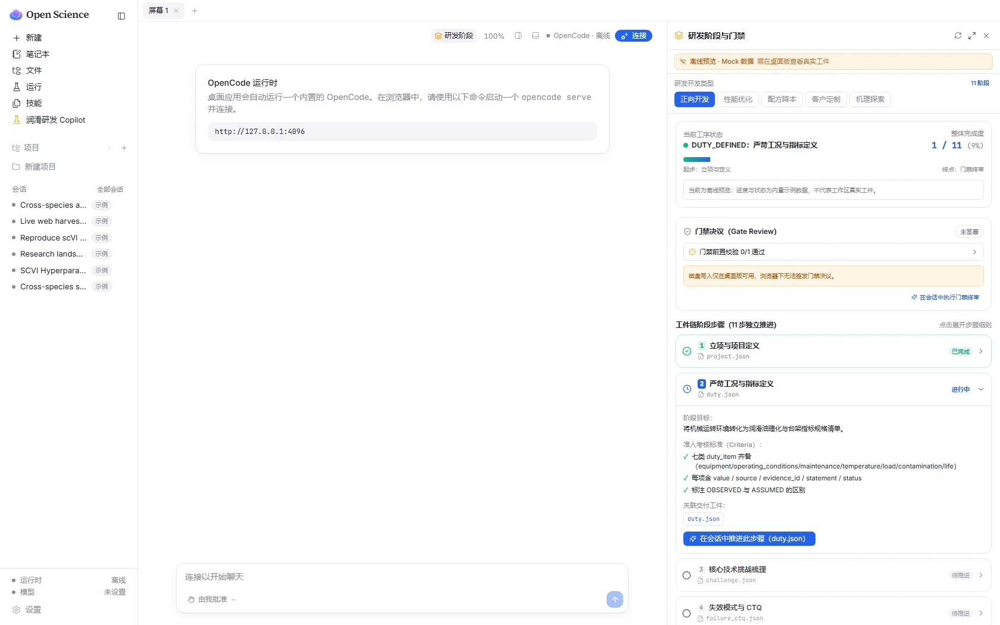
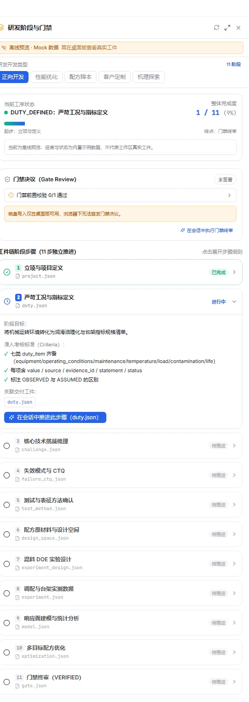

# Lubricant R&D OS — 工业润滑油决策驱动研发操作系统

> **基于 [ai4s-research/open-science](https://github.com/ai4s-research/open-science) 架构的工业润滑油产品开发 AI Agent 领域包（Domain Pack）**  
> 当前版本：`V0` | 规范契约：`Draft 2020-12 JSON Schema` | 许可证：`MIT`
>
> 📍 **本领域包位于 [`kaiz1995/Lubricant-R-D-OS`](https://github.com/kaiz1995/Lubricant-R-D-OS) 仓库的 `domains/lubricant/` 目录下**（2026-09-22 由独立仓库 `lubricant-rd-domain-pack` 合并进来，92 个提交的历史完整保留）。
> 下文所有 `python scripts/...`、`python -B tests/...` 命令均**以本目录为工作目录**执行。

---

## 1. 这是什么（产品定位）

**Lubricant R&D OS** 是一套运行在 Lubricant Science 科研工作台上的**工业润滑油产品开发决策助手（R&D Copilot & Operating System）**。

它**不是**一个简单的"输入几个技术指标，AI 自动吐出配方"的黑盒生成器。它的核心使命是：

> **把润滑油研发从"经验试错与逆向仿制"升级为"科学决策与证据闭环"**。  
> 让每一个配方决策都有工况证据支撑，每一次实验设计都最大化信息增益，每一个阶段流转都可追溯、可审计、可复用。

---

## 2. 核心优势

工业润滑油配方属于核心商业机密，且研发决策依赖严谨的物理实验与数据溯源。相比使用通用聊天型 AI 或从零自研桌面软件，基于 Lubricant Science 开发具备以下四大不可替代的底座优势。

以下每一条都按 **「通用 Agent 的痛点」→「Lubricant Science 的机制」→「覆盖边界」** 的结构展开，并给出具体实现位置，便于核对。

---

### 2.1 完整的科研数据血统追溯（Scientific Provenance）

#### 2.1.1 痛点：通用 Agent 的推导过程活在会话里

会话上下文是**易失缓存**，不是持久存储。它会在两个时刻丢失：

**其一，上下文压缩时。** 窗口满了，Agent 会把前面的对话"总结"一遍再塞回去 —— 注意是**总结**，不是**备份**。它丢掉的是它认为不重要的细节，而研发推导里最要命的恰恰是细节：为什么这组混兑点被排除、哪个约束卡住了成本上限、第一次试算为什么失败。这些一旦被"总结"掉，原始逻辑就永久消失了。

**其二，会话结束时。** 关掉窗口、开新会话，所有推理连同上下文一起归零。这是设计使然，不是缺陷 —— 通用 Agent 的定位是"把问题答好"，它不认为"过程"是需要交付的资产。

**还有第三层，也是最容易被忽略的一层：即使聊天记录还在，产物与过程之间也没有反向索引。**

聊天记录是一条**线性文本流水**。你手上拿着 `Freeze Formula V7`，无法从这个文件倒推回"是哪句话、哪次计算、哪批实验造出了它"。关联断了。

> **这才是"黑盒"的准确定义：不是没有日志，而是结论和证据之间的连接点丢了。**

#### 2.1.2 机制：把过程写在磁盘上，而不是留在上下文里

Lubricant Science 把落盘时机**前置到"每次写入 / 每次执行"**，而不是等会话结束：

| 记录类型 | 落盘位置 | 触发时机 |
|---|---|---|
| 文件版本记录 | `.openscience/provenance.jsonl` | Agent 每次写入工作区文件 |
| 执行记录 | `.openscience/runs.jsonl` | Agent 每次执行代码 |

两条日志都是 **append-only**：只追加，不覆盖、不删除；写入用互斥锁串行化，防止两条记录交错。同一文件多次修改会累积成 `v1 / v2 / v3 …` 递增版本。这是"不可篡改"的工程含义 —— **历史只能增长，不能被改写**。

**关键字段一览：**

| 记录 | 字段 | 含义 |
|---|---|---|
| provenance | `path` | 工作区相对路径 —— **反向索引的锚点** |
| provenance | `version` | 该文件第几版，从 1 递增 |
| provenance | `ts` / `tool` | 时间戳 / 由哪个工具写入 |
| provenance | `session_id` / `model` | 哪个会话、哪个模型产生的 |
| provenance | `content` / `diff` | 写入的全文，或增量编辑的 unified diff |
| provenance | `env` | 运行环境快照（见 §2.1.4） |
| provenance | `run_id` | **关联到 `runs.jsonl` 的那次执行** |
| runs | `command` / `code` | 执行的命令 / 入口脚本哈希 |
| runs | `outputs` | 这次执行产出或改动的文件 |
| runs | `log_hash` | stdout / stderr，内容寻址存放于 `.openscience/logs/` |
| runs | `surface` | 执行位置：本地 / HPC / Modal / Jupyter / SSH |

#### 2.1.3 "无缝追溯"是怎么实现的

靠的是**双向可走的索引**，而不是有人维护一张关系表：

```
Freeze Formula V7（终版配方）
        │
        │  provenance.jsonl 按 path 反查全部版本
        ▼
该文件的版本记录
  path · version · ts · session_id · model
        │
        │  run_id 关联
        ▼
那次执行的完整记录（runs.jsonl）
  command · code hash · env · outputs · log
        │
        │  outputs / 输入路径继续上溯
        ▼
上游输入（每个文件同样自带 provenance 记录）
  DOE 混兑点 · 实验批次 · 检验方法版本 · 原料批次物化属性
        │
        │  继续上溯
        ▼
物理实验原始记录
```

链条能一直走下去，原因是：**每一环都是工作区里的一个文件，而每个文件都有自己的记录**。不需要额外维护关联关系。

- 每条版本记录都带 `path` → 拿着任意文件，都能捞出它的全部历史版本
- 每条版本记录都带 `run_id` → 指向 `runs.jsonl` 里那次执行
- 执行记录带 `outputs` 与 `code` → 向下查"这次跑产出了什么"，向上查"这个结果是谁造的"

#### 2.1.4 记录的不只是"改了什么"，而是"凭什么这么改"

这是它与普通日志的分水岭。每条版本记录都携带完整的环境快照：

| 记录项 | 通俗含义 |
|---|---|
| `command` + `code`（脚本哈希） | 跑的是**哪个版本**的哪段代码 |
| `env.python` / `env.platform` / `env.app` | 当时的**运行环境** |
| `env.packages`（pip freeze，内容寻址去重） | 装了**哪些包、什么版本** |
| `env.hardware`（CPU / 内存 / GPU） | 跑在**什么机器**上 |
| `outputs` | 这次跑**产出了哪些文件** |
| `log_hash` | 当时的**完整输出** |
| `session_id` + `model` | **哪个会话、哪个模型**做的 |

注意最后一行：连"哪个模型、哪次对话"都被写进了文件。**上下文压缩掉的东西，磁盘上有备份。**

复现一个配方，不只需要步骤，还需要当时的 Python 版本、依赖包版本、硬件环境，以及跑的是哪个版本的脚本 —— 这些全部在记录里。

#### 2.1.5 覆盖边界（如实说明）

这套机制覆盖**工作区内发生的一切**。有三种情况链条会断，应当如实说明：

1. **数据从未进过工作区** —— 例如实验数据从 LIMS 导出后直接在 Excel 里手工修改，未走工作区流程，不会产生记录。
2. **记录是有上限的** —— `content` 截断在 10 万字符、`log` 截断在 20 万字符、单次执行最多记录 200 个输出文件、超过 5MB 的文件只记路径与大小、不做内容哈希。账本是**有界的完整**，不是无限完整。
3. **人在工作区外手工改文件** —— 这一步没有 provenance 条目，链条会缺一环。

因此准确表述是：**凡在工作区内由 Agent 写入或执行产生的工件，均可完整追溯。**

---

### 2.2 工业级数据隐私与离线闭环（Local-First Architecture）

#### 2.2.1 痛点：通用 Agent 的数据物理上在别人的机器里

云端 SaaS 的架构决定了：企业绝密的基础油组分、添加剂配比、专有成本与客户工况，都存放在服务商的服务器上。"删除"通常只是标记删除 —— 备份副本、日志副本、灾备副本你不可控。你能依靠的只有**对方的承诺**。

#### 2.2.2 机制：Local-First 是三层，不是一句"数据在本地"

很多人把 Local-First 讲成一句"数据都在本地"，太粗。实际上它是三层，**其中两层无条件成立，一层取决于你的选型**：

| 层 | 保障内容 | 成立条件 |
|---|---|---|
| **存储层** | 数据落在哪 | **无条件成立** |
| **访问层** | 谁能碰数据 | **无条件成立** |
| **推理层** | 数据出不出网 | **取决于模型选型** |

##### 第一层：存储层 —— 数据 100% 在本机

- 默认工作区为 `~/Documents/OpenScience`（Windows 下为 `%USERPROFILE%\Documents\OpenScience`），可在设置中改到任意本地路径
- 会话、项目、文件、`provenance.jsonl`、`runs.jsonl`、执行日志、notebook **全部在这棵目录树下**
- 本地 SQLite（`runs.db`）只是**派生的读模型 / 索引**，`runs.jsonl` 才是 durable source of truth。索引可丢弃、可按字节水位从日志懒重建 —— **审计证据不依赖数据库完好**：数据库损坏了，证据还在
- 工作区同时是**本地 git 仓库**，且代码层面**禁止配置远端、禁止 push** —— 不是"承诺不上传"，是**没有上传的能力**

##### 第二层：访问层 —— 沙箱 + 审批 + 密钥隔离

底座仓库的 `AGENTS.md` 中有一节 *Safety defaults (non-negotiable for the desktop)*，三条硬约束：

| 约束 | 内容 |
|---|---|
| **访问范围** | Agent **只能访问当前工作区**；文件路径严格沙箱在工作区根，越界路径直接拒绝 |
| **操作审批** | 执行命令、删除文件、安装依赖、建立远程连接**均需人工批准**；手动审批为默认模式，**"永不发布 off"** |
| **密钥隔离** | API key 存入**操作系统钥匙串 / 凭据管理器**，**绝不写入 provenance、日志、崩溃报告、git 或导出项目** |

> 第三条值得单独说明：连 provenance 都不允许存 key。因为 provenance 是要被审计、被导出的 —— **如果 key 进去了，审计材料本身就成了泄露源**。

此外，本地预览网关**默认只监听 `127.0.0.1`（回环地址）**，暴露到局域网需要显式开启；Agent 生成的 HTML 预览页面附带 `CSP: sandbox` 响应头，防止其反向读取本地文件。

##### 第三层：推理层 —— 这才是分水岭

| 模型选型 | 出网情况 | 适用场景 |
|---|---|---|
| **本地模型**（Ollama / LM Studio / vLLM 等，走 `127.0.0.1`） | **出网流量为零**，真正的物理隔离；且回环地址被豁免代理，本地模型流量不经代理、不出机器 | 配方机密等级最高、完全离线环境 |
| **云端商用模型**（OpenAI / Anthropic / 自建网关） | 提示词内容出网；但通道**可控** —— 代理设置支持 `system` / `custom` / `none` 三档，可指向企业自建内网网关 | 需要更强模型能力、且网络环境可信 |

#### 2.2.3 为什么这一条对润滑油配方格外重要

配方与普通数据不同，有三个性质决定了它的安全等级：

1. **组分比例本身就是全部价值** —— 源代码还有编译、混淆、授权校验兜底；配方就是几个百分比数字，抄下来就能用。
2. **泄露不可逆** —— 密码泄露可以改，密钥泄露可以轮换，配方泄露之后没有"换一个"这个选项。
3. **双向敏感** —— 客户工况数据（电厂汽轮机、风场齿轮箱、压缩机组的运行参数）是**客户的**机密，泄露要承担商务与法律责任。

因此这里的要求不是"最好别泄露"，而是**"不可能泄露"**。云端 SaaS 的架构天生只能做到"承诺不会" —— 数据物理上在别人的机器里。Local-First 是唯一能把这句话从"承诺"变成"结构"的路线。

#### 2.2.4 表述边界（对外沟通注意）

- **不要说"绝对不出网"** —— 一旦接入云端模型，这句话立刻被证伪。准确说法是：**默认不出网，出网必须是你主动选择的**。
- **不要回避本地模型的能力天花板** —— 本地中小参数模型在复杂推理与长文档理解上，与云端旗舰模型存在量级差距。安全性与能力是 **trade-off**，是**选项**，不是白拿。
- **"离线闭环"指的是数据面，不是工具面** —— 安装 Python 包、拉取模型权重、检索文献仍然需要网络。准确说法是**"研发数据不出闭环"**，而非"断网也能全功能运行"。

---

### 2.3 LLM 语义路由与确定性科学计算的严格解耦

#### 2.3.1 痛点：让一个擅长措辞的系统，去做它最不擅长的事

通用 Agent 直接让大模型输出数字 —— 估算粘度、核算成本、拟合回归曲线。这些数字**看起来完全合理**，但没有一次真实计算支撑。而这类错误极难被察觉，因为错的往往只是小数点后几位，整体表述却足够专业。

在润滑油研发场景下，这种"工程幻觉"的代价是四重的：

1. **数字看起来合理** —— 模型知道 ISO VG 320 齿轮油的大致粘度区间，它会给出一个"像那么回事"的值，凭直觉发现不了错。
2. **错误向下游传播** —— 一个虚假的粘度值进入 DOE 设计，选出的混兑点全部偏离，实验白做，数周时间与样品成本付诸东流。
3. **最危险的是"混合幻觉"** —— 算对 90%、错 10%，整体看起来非常专业，最难识别。
4. **审计无法溯源** —— 审计员问"这个数怎么来的"，答"模型算的"，等于没有回答。

#### 2.3.2 机制：一条硬边界 —— 语义归模型，数字归引擎

| 环节 | 责任方 | 产出 |
|---|---|---|
| 理解意图 | 大模型 | 把口语需求翻译成任务 |
| 结构化提取 | 大模型 | 符合 JSON Schema 的输入参数 |
| 调用引擎 | 大模型 | 只传参，**不接触计算过程** |
| 解释结果 | 大模型 | 把数字翻译成人话 |
| **成本计算** | 确定性引擎 | 数字（可复算） |
| **DOE 混兑点生成** | 确定性引擎 | 混料实验点矩阵 |
| **方差分析（ANOVA）** | 确定性引擎 | 方差分析表 |
| **多目标优化** | 确定性引擎 | Pareto 候选解集 |
| **阶段判定（GO / HOLD）** | 策略规则 | 决策字段 |
| **产出校验** | 校验器 | 通过 / 拒绝 |

四个机制共同保证这条边界成立：

##### 机制一：接口隔离 —— 模型碰不到计算过程

计算引擎的入口只有 43 行：从 **stdin 读取 JSON** → 按 `--engine` 参数分发到四个纯函数（`calculate_cost` / `generate_doe` / `analyze_statistics` / `optimize`）→ 结果写入 **stdout**。

模型在这里的角色只是**构造符合 schema 的输入**，然后调用。**数字由脚本输出，模型没有机会改写它。** 这是物理隔离，不是约定。

##### 机制二：确定性优先 —— 相同输入必须产出逐字节相同的结果

引擎按"确定性优先"设计，其统计引擎源码注释中明确写着：

> Deterministic First: same input bytes produce byte-identical envelopes.

为达成这一点，连 **F 分布的 CDF 都是自行实现的**（正则化不完全 beta 函数 + Lentz 连分数法，依据 Numerical Recipes 3rd ed. §6.4 与 Lentz 1976, *Applied Optics* 15, 668），并**刻意不依赖第三方科学计算库** —— 因为库版本升级可能改变数值结果，破坏"相同输入产出相同结果"的承诺。

引擎与方法均带版本号（如 `METHOD = "OLS_ANOVA_V1"`），因此结果可以标注"由哪一版方法算出"，多年后重算仍可对齐。

##### 机制三：证据边界 —— 合成数据的结果自带"不可放行"标签

输入必须声明证据等级 `evidence_scope`，取值 `SYNTHETIC`（合成 / 演示数据）或 `PHYSICAL`（实物实验数据）。当输入为 `SYNTHETIC` 时，输出会**自动附带**使用约束：

| 约束标签 | 含义 |
|---|---|
| `SYNTHETIC_DEMO_ONLY` | 仅限演示 |
| `NOT_FOR_PHYSICAL_RELEASE` | **不得用于实物放行** |
| `CANNOT_QUALIFY_METHOD` | **不得用于方法确认** |

标签由引擎根据输入证据等级自动打上，**人无法手动摘掉**。同时输出携带 `input_sha256`，与输入哈希绑定 —— 输入被改动，哈希即失配。

##### 机制四：判定规则硬编码在策略脚本中，不在模型脑子里

阶段判定（`GO` / `HOLD`）由策略脚本中的纯函数计算得出，而非模型判断。策略脚本同时在产出中写入主动免责声明：

> 供应的边界、约束、来源与溯源未经独立验证；标记为 ASSUMED 的证据仍然只是假设，本记录**不构成配方、实验、性能、成本或优化的结论**。

#### 2.3.3 一句话总结

> **模型负责说人话，引擎负责算准数，账本负责证明这个数是谁算的。**

三条优势在此闭环：**可追溯的前提，是数字本身不是模型编的。**

---

### 2.4 开箱即用的专业科研基础设施（无需重复造轮子）

#### 2.4.1 痛点：从零自研，"基建"会吃掉大部分精力

要自研一套能承载配方研发的桌面工作台，需要自行解决六类基础设施：跨平台打包与签名公证、Agent 运行时进程管理、多模型凭据与权限适配、MCP 工具协议、Python / Jupyter 计算环境、项目与会话隔离。

这些工作与润滑油机理**毫无关系**，却必须完成；完成后也不产生任何领域价值。

#### 2.4.2 机制：底座已完整封装六类基建

| 基建类别 | 已封装内容 | 对应实现规模 |
|---|---|---|
| **跨平台桌面壳** | Tauri 2；macOS `.dmg` / `.app`（含签名与公证）、Windows NSIS `.exe` + WiX `.msi`、Linux `.deb` / `.rpm` | 3 平台 |
| **Agent 运行时** | OpenCode（[anomalyco/opencode](https://github.com/anomalyco/opencode)）作为隔离 sidecar：随安装包分发、独立端口、app 私有配置与数据目录、自动启动 | 4 个随包二进制 |
| **多模型适配** | provider 凭据与模型注入、审批模式合并与权限规则适配、自定义 OpenAI 兼容端点 | 1,464 行 |
| **MCP 协议层** | 一键将开源科学 MCP server 装入**独立 uv 环境**（不动用户 Python 环境），并注册到运行时配置 | 849 行 |
| **计算执行环境** | Python / R 常驻内核（跨 cell 保持状态）、uv 环境管理、Jupyter、本地预览服务 | 1,952 行 |
| **项目与会话隔离** | 工作区沙箱、本地 git 快照、会话同步 | 2,698 行 |

随安装包分发的四个二进制为 `opencode` / `uv` / `agent-browser` / `osd` —— **用户无需自行安装 Node、Python 或浏览器驱动**。底座（不含第三方二进制）的总代码量约 **8.3 万行**。

#### 2.4.3 真正昂贵的不是代码，而是踩过的坑

写代码是确定性成本，可以估工期；**踩坑是不确定性成本**，能吃掉数倍于编码的时间。底座源码中已固化了几类典型问题的处理逻辑：

| 问题 | 现象 | 处理方式 |
|---|---|---|
| **企业内网依赖安装静默挂死** | 代理、TLS 深度检查、杀毒软件拦截导致下载卡住，界面永远停在 "Setting up…"，**零诊断信息** | 改为流式推送每一行输出到前端，并设置**无输出超时自动终止**，把静默挂死变成可读错误 |
| **Agent 运行时权限规则互相覆盖** | 审批弹窗行为异常，从功能列表上完全看不出问题 | 运行时会把所有权限规则**拍平为单一列表并按"最后匹配生效"求值**，且外部目录有独立的默认询问规则 —— 因此每种审批模式都必须显式声明对外部目录的意图 |
| **多平台发布抢同一个 Release** | 一次 tag 推送产生两个相隔一秒的相同构建，同时写入同一个草稿 Release，造成资产重复与竞态 | 增加并发组约束；同时保留平台矩阵（每个平台的安装包只能在其自身 runner 上产出） |

这些坑的共同点是：**都不在功能清单上，但都会真实地消耗研发时间。**

#### 2.4.4 底座额外提供的能力

| 能力 | 用途 |
|---|---|
| 远程计算（SSH / HPC / Modal） | 大规模 DOE 可提交到集群，本地只做设计与分析 |
| 移动端 / 浏览器访问 | 通过本地网关在手机查看进度与结果 |
| 编辑器互操作（ACP） | 支持外部编辑器驱动本工作台，也支持在本工作台中运行其他 ACP Agent |
| 浏览器控制 | 检索竞品技术资料、原料供应商页面 |
| 多格式工件查看器 | PDF、Office 三件套、CSV、图片、分子结构、3D mesh、FITS 等直接预览 |

#### 2.4.5 表述边界（对外沟通注意）

- **"开箱即用"限定在基建层面，不延伸到领域能力** —— 底座提供的是"能跑科学计算的车间"，不是"润滑油配方算法"。润滑机理模型、DOE 试验设计规则、检验方法判定阈值，仍然是需要自行沉淀的核心资产（以 Skill 形式实现）。
- **"随包分发第三方运行时"是双刃剑** —— OpenCode 是第三方 Agent 运行时，意味着迭代节奏部分受其约束：其 API、配置格式、权限模型变更时需跟随适配。收益是不必自研 Agent 内核，代价是升级时需要重新验证。这一 trade-off 应主动说明，而非等待被问。

---

## 3. 研发背景与行业痛点

传统工业润滑油研发长期被三大痼疾困扰：

1. **重逆向、轻正向，缺乏体系化方法**：
   - 研发高度依赖"找竞品 → 剖析配方 → 仿制小样 → 台架试错"。逆向开发有参考价值，但不能成为研发主体。一旦工况变化或原料断供，缺乏推导逻辑导致无法自主应对。
2. **实验碎片化与经验式试错（OFAT 陷阱）**：
   - 习惯于"换个添加剂、改个比例、做个试验"的一次只改一个变量（OFAT）模式，缺少统一的设计空间、变量约束和假设检验框架。
3. **课题长流水，缺乏阶段退出与设计冻结机制**：
   - 降本、性能调整、原料替换年年持续，研发没有明确的终止条件（Stopping Rule）和设计冻结（Design Freeze）标准。
4. **"拿着未经校验的尺子量配方"**：
   - 很多台架试验和实验室评价方法本身缺乏工况相关性与区分度，导致用不灵敏的方法筛选配方，得出假阳性或假阴性结论。
5. **原料波动与牌号依赖**：
   - 过于依赖特定供应商的具体商品牌号，缺乏基于基础油物化描述符（粘度指数、极性、溶解度、烃组成）与功能模块的属性管理体系。

---

## 4. 核心研发哲学（Decision-Driven R&D）

本项目严格遵循决策驱动研发框架（Decision-Driven R&D Framework）：

* **润滑油不是在"通过标准"，而是在具体设备工况下承受特定挑战**：关注具体摩擦副、温度谱、载荷谱、污染与寿命。
* **研发目标是"风险控制 + 商业价值优化"，而非单一指标最优**：
  * **约束满足型产品**（常规工业油）：在满足 CTQ 与风险阈值的前提下，追求成本最低与供应链稳定（$Minimize\ Cost\ s.t.\ CTQ_i \ge Limit_i$）。
  * **综合价值型产品**（风电齿轮油、空压机油）：追求性能安全余量与关键失效机理的长期可靠性。
* **"先证明尺子可靠，再用尺子量配方"**：必须在研发早期对测试评价方法进行资格确认（Method Qualification），验证其区分性与工况相关性。
* **逆向开发的角色定位**：正向设计为主体，逆向分析仅作为边界核对与对比基线（Benchmark Calibration），而非开发起点。
* **证据级别与隔离铁律**：严禁 AI 编造数据，严格隔离合成占位数据（`SYNTHETIC`）与真实物理实验数据（`PHYSICAL`）。合成数据仅用于验证软件流转，物理放行必须依赖真实实验证据。

---

## 5. 五大类研发性质与差异化流程

工业润滑油开发不是一条死板流水线。系统在**项目定义阶段（Stage 0）**首先识别或引导用户确认项目的具体性质，并自动分流到匹配的专属流程：

| 研发性质 | 核心驱动逻辑 | 差异化阶段路径（Stage 流转） | 核心关注点与输入要求 |
|---|---|---|---|
| **1. 新产品正向开发**<br>(`NEW_PRODUCT`) | 需求与工况驱动 | `Project → Duty(7项) → Challenge → Failure/CTQ → Method Qual → Design Space → DOE → Running → Model → Opt → Gate` | 完整 7 大工况、润滑挑战映射、失效机理深度分析、混料空间与多目标优化。 |
| **2. 已有产品性能优化**<br>(`IMPROVEMENT`) | 现场失效与痛点驱动 | `Project → Failure/CTQ(问题诊断) → Method Qual(灵敏度) → Design Space → DOE → Running → Model → Opt → Gate` | **跳过全套工况重推**。聚焦现场真实失效证据，先验证评价方法灵敏度，再对瓶颈指标做定向配方改良。 |
| **3. 降本替代**<br>(`COST_DOWN`) | 非劣效性驱动<br>(Non-inferiority) | `Project → Failure/CTQ(非劣效红线) → Design Space → DOE → Running → Opt → Gate` | **不推新工况**。基于成熟基线配方与成本结构，划定 CTQ 不劣化底线，优化替代材料属性安全域。 |
| **4. 客户定制**<br>(`CUSTOMIZATION`) | 技术协议/OEM规范驱动 | `Project → Failure/CTQ(协议指标映射) → Method Qual(指定台架) → Design Space → DOE → Running → Gate` | 以客户技术协议和指定认证台架为准绳，快速匹配成熟平台做微调验证。 |
| **5. 机理/平台型探索**<br>(`EXPLORATION`) | 科学假设驱动 | `Project → Design Space → DOE → Running → Model → Gate` | **不考核商业 target_cost 和量产**。允许试错，重点提取变量影响规律与知识资产沉淀。 |

---

## 6. 系统架构设计

系统采用**解耦的三层架构**，确保通用科研底座与润滑油领域逻辑相互隔离，支持随上游 Lubricant Science 持续平滑升级：

```
┌────────────────────────────────────────────────────────────────────────┐
│                        Lubricant Science 桌面工作台                         │
│       (Tauri 2 + React + OpenCode Agent Runtime + 本地工作区 + Provenance) │
└───────────────────────────────────┬────────────────────────────────────┘
                                    │ 调用 / 加载
┌───────────────────────────────────▼────────────────────────────────────┐
│                  Lubricant R&D Domain Pack (本仓库)                    │
│                                                                        │
│  [Stage 0-4 研发技能群 (12 Skills)]                                    │
│  - project-definition          - duty-definition                       │
│  - duty-challenge-analysis     - failure-ctq-analysis                  │
│  - test-method-qualification   - formulation-design                    │
│  - doe-design                  - experiment-import                     │
│  - statistical-analysis        - optimization                          │
│  - gate-review                 - lubricant-rd-agent (元路由器)          │
│                                                                        │
│  [数据契约与状态机]                                                    │
│  - Draft 2020-12 JSON Schemas (10类核心研发工件标准契约)                │
│  - 阶段状态机 (contracts/state-machine.json: ALLOW/DENY/HOLD 门控)     │
│                                                                        │
│  [数据层与计算引擎 (Phase 4)]                                          │
│  - SQLite 五表存储 (material / formula / test_method / experiment 等) │
│  - Cost Engine (原料成本核算)   - Mixture DOE Engine (混料极值设计)   │
│  - Statistics Engine (响应面回归) - Optimization Engine (Pareto 优化)    │
└────────────────────────────────────────────────────────────────────────┘
```

> **关于"为什么选择基于 Lubricant Science 开发"** —— 四大底座优势（科研数据血统追溯 / 工业级数据隐私与离线闭环 / LLM 语义与确定性计算解耦 / 开箱即用的专业科研基础设施）的完整说明已前置到 **§2 核心优势**。本节只讲架构如何解耦。

---

## 7. 12 个领域技能清单 (Skills)

每个 Skill 均为**自包含目录**（`SKILL.md` + `scripts/`），由 Lubricant Science 内置的 **OpenCode Agent 运行时**扫描加载：运行时读取 `SKILL.md` 的 YAML frontmatter（`name` + `description`）把技能注册为可按需调用的能力，**无需修改运行时源码**即可增删技能 —— 这正是领域包能独立插拔的原因。每个技能输出遵循标准 JSON Schema 的结构化工件：

| Skill 名称 | 所属阶段 | 输出状态 / 工件 | 关键功能与职责 |
|---|---|---|---|
| `project-definition` | Stage 0 | `PROJECT_DEFINED` | 引导用户确认 5 类研发性质，定义商业/技术目标、硬约束与项目章程。 |
| `duty-definition` | Stage 1 | `DUTY_DEFINED` | 结构化录入 7 大工况（设备、工况谱、维护、温度、负荷、污染、寿命）。 |
| `duty-challenge-analysis`| Stage 1 | `CHALLENGES_DEFINED` | 从工况推导润滑挑战 Map（严重度、暴露度、敏感度分级）。 |
| `failure-ctq-analysis` | Stage 2 | `FAILURE_CTQ_DEFINED` | 梳理失效机制与关键质量特性（CTQ），建立挑战到性能的映射链。 |
| `test-method-qualification` | Stage 2 | `TEST_METHODS_QUALIFIED` | 评价方法资格确认，验证测试方法与真实工况的相关性及区分能力。 |
| `formulation-design` | Stage 3 | `DESIGN_SPACE_DEFINED` | 建立基础油与添加剂混料设计空间，设定物理与化学约束边界。 |
| `doe-design` | Stage 3 | `EXPERIMENT_DESIGNED` | 结构化生成混料实验设计（D-Optimal / Extreme Vertices）评估请求。 |
| `experiment-import` | Stage 3 | `EXPERIMENT_RUNNING` | 录入实验测试观测结果，强制校验测试批次与物理溯源凭证。 |
| `statistical-analysis` | Stage 4 | `MODEL_BUILT` | 拟合回归与响应面模型，提供残差检验与模型解释力报告。 |
| `optimization` | Stage 4 | `OPTIMIZED` | 基于成本与 CTQ 模型执行多目标约束优化，给出候选配方推荐。 |
| `gate-review` | 评审门禁 | `VERIFIED` | 汇总阶段证据链，执行正式审查决策（GO / HOLD / PIVOT / KILL）。 |
| `lubricant-rd-agent` | 核心路由 | — | 元技能（Meta-Skill）路由器，执行跨阶段拦截、性质分流与证据门控。 |

---

## 8. 快速开始与使用指南

### 8.1 前置条件
- 已安装 [Lubricant Science Desktop](https://github.com/ai4s-research/open-science/releases) v0.5.1 或更高版本
- 本地安装 Python 3.10+ 环境

### 8.2 安装领域包技能至 Lubricant Science
在本目录（`domains/lubricant/`）执行 PowerShell 命令，一键将 12 个领域技能部署到 Lubricant Science Desktop 用户目录：

```powershell
# 将全部 12 个领域技能安装到 Desktop
python scripts/install_domain_skill.py --all `
  --target "C:\Users\<用户名>\AppData\Roaming\com.ai4s.workbench\runtime\xdg-config\opencode\skills\user"
```

安装完成后重启 Lubricant Science 桌面端，在工作台「技能」面板中即可直接查看和使用。

### 8.3 桌面三栏工作台（研发阶段与门禁）

领域包不只是"一堆技能"。在 Lubricant Science 桌面端，研发链会直接渲染成**右侧第三栏**：

| 栏位 | 归属 | 内容 |
|---|---|---|
| 左 | Lubricant Science 原生 | 项目 / 会话 / 技能导航 |
| 中 | Lubricant Science 原生 | 多模型对话流 + 工具调用 + 输入框 |
| **右** | **本领域包** | **「研发阶段与门禁」：11 步工件链 + 整体进度 + 门禁决议** |

**进入方式**：左侧边栏点「润滑研发 Copilot」，或访问 `/lubricant` 路由。

面板由**工作区磁盘上的真实工件**驱动，不是静态演示：

| 工作区状态 | 面板表现 |
|---|---|
| 工件存在且结构合规 | 该步标记「已完成」 |
| 第一个缺失的工件 | 自动成为「进行中」 |
| 结构不合规（如 `artifact_type` 写错） | 该步标红「不合规」并列出原因，**不点亮** |
| `project.json` 存在 | 其 `project_type` **锁定**研发类型选择器，并决定步骤数（11 / 9 / 7 / 7 / 6） |

门禁卡片汇总上游证据链并逐条展示前置校验；存在阻塞项时**禁止签发 GO**（fail-closed），决议值域严格为 `GO / HOLD / PIVOT / KILL / FREEZE`。

**每一步都可一键推进**：展开步骤卡片 → 点「在会话中推进此步骤」→ 面板把带技能名与工件名的标准化提示词写入中栏输入框（**不自动发送**，由研发员确认后回车）。

> 真实工件状态需在**桌面版**中查看；浏览器环境下面板会显示「离线预览 · Mock 数据」徽标，不读取本地文件。

### 8.4 新项目启动（活报告工作区）
新课题按以下步骤初始化工作区，使项目自带"活报告"进度机制：

1. 在 Lubricant Science 中新建项目工作区；
2. 复制 `templates/project-workspace/AGENTS.md` 到项目根目录，仅修改"角色与使命"中的一句话核心目标；
3. 复制 `templates/project-workspace/docs/开发报告模板.md` 到项目 `docs/` 目录并按项目命名；
4. 后续所有技能执行落盘后，副驾驶会按 AGENTS.md 中的"活报告维护"规则自动同步该报告；项目全门禁通过后，该报告即成为完整开发报告交付。

### 8.5 软件侧离线自动化验证
领域包自带完整的无外部依赖原生测试套件，无需启动桌面端即可完成端到端验证（在本目录执行）：

```powershell
# 1. 验证工作区打包与数据范围安全隔离
python -B tests/test_workspace_bundle.py

# 2. 验证 SQLite 数据库原子性与数据上限
python -B tests/test_lubricant_db.py

# 3. 验证 12 个 Skill 部署兼容性
python -B tests/upstream_compat/test_skill_install.py

# 4. 验证元技能多流程分支路由逻辑
python -B tests/test_meta_skill_routing.py

# 5. 执行全量 Release 前置检查门禁
python -B tests/test_release_preflight.py
```

---

## 9. 软件使用说明（桌面端操作指引）

> 本章讲**怎么用**。软件的技术架构见 §6，技能清单见 §7，安装部署见 §8。

### 9.1 软件是什么

**Lubricant R&D OS 不是一个独立软件**，而是 [Lubricant Science Desktop](https://github.com/ai4s-research/open-science) 的下游分支 —— 同一个桌面壳，只做了两处叠加：

1. 内置 12 个润滑油研发技能（`domains/lubricant/skills/`）；
2. 右侧多出一个「**研发阶段与门禁**」面板。

**进入方式**：左侧边栏点「**润滑研发 Copilot**」，或访问 `/lubricant` 路由。面板标题栏右侧的 `×` 可收起，刷新按钮可手动重新扫描工件。

进入后，**左栏与中栏和原生 Lubricant Science 完全一致**（项目 / 会话 / 技能导航 + 多模型对话流 + 输入框），只有右栏是本领域包新增。也就是说：不需要学一套新软件，只需要学右栏这一块。



> **上图**：桌面端「润滑研发 Copilot」实机界面 —— 左栏导航（含「润滑研发 Copilot」入口）、中栏会话流、右栏「研发阶段与门禁」。右栏是本领域包新增部分。

### 9.2 右栏面板导览

面板自上而下分六个功能区：

| 区域 | 作用 | 关键行为 |
|---|---|---|
| **标题栏** | 标题 + 刷新 + 收起 | 「重新扫描工件」手动触发一次工作区探测 |
| **数据源条** | 当前数据来源 | 桌面版显示工作区路径与「距上次扫描多久」；浏览器显示「离线预览 · Mock 数据」 |
| **研发开发类型** | 5 类研发性质切换 | 正向开发 / 性能优化 / 配方降本 / 客户定制 / 机理探索，右上角标注该路线的**阶段数** |
| **当前工序状态** | 整体进度总览 | 进行中的工序名 + 完成度 `N/M (X%)` + 进度条 |
| **门禁决议** | 证据链汇总与签发 | 前置校验逐条列出，满足条件才允许签发 GO |
| **工件链步骤** | 逐步推进 | 每步显示状态徽章与工件名，展开可见阶段目标与考核标准 |



> **上图**：右栏面板实机界面 —— 研发类型选择器、当前工序与完成度、门禁决议（含前置校验）、11 步工件链。图中为**浏览器离线预览态**（数据源条显示「离线预览 · Mock 数据」）；桌面版布局完全一致，仅数据源换成工作区真实工件。

### 9.3 工件链：11 步与 5 条路线

面板的核心是一条**工件链**。每一步的产出是一个结构化 JSON 工件，落盘在工作区；面板**读磁盘**判断该步状态，不依赖会话记忆。

**完整 11 步链**（`NEW_PRODUCT` 新产品正向开发）：

| # | 工序 | 技能 | 交付工件 |
|---|---|---|---|
| 1 | 立项与项目定义 | `project-definition` | `project.json` |
| 2 | 严苛工况与指标定义 | `duty-definition` | `duty.json` |
| 3 | 核心技术挑战梳理 | `duty-challenge-analysis` | `challenge.json` |
| 4 | 失效模式与 CTQ | `failure-ctq-analysis` | `failure_ctq.json` |
| 5 | 测试与表征方法确认 | `test-method-qualification` | `test_method.json` |
| 6 | 配方原材料与设计空间 | `formulation-design` | `design_space.json` |
| 7 | 混料 DOE 实验设计 | `doe-design` | `experiment_design.json` |
| 8 | 调配与台架实测数据 | `experiment-import` | `experiment.json` |
| 9 | 响应面建模与统计分析 | `statistical-analysis` | `model.json` |
| 10 | 多目标配方优化 | `optimization` | `optimization.json` |
| 11 | 门禁终审（VERIFIED） | `gate-review` | `gate.json` |

其余四类研发性质按 §5 的裁剪规则取子集，阶段数依次为 **9 / 7 / 7 / 6**。

**每一步的四种状态**：

| 徽章 | 含义 | 判定依据 |
|---|---|---|
| 待推进 | 尚未开始 | 工件不存在 |
| 进行中 | 当前焦点 | 它是**第一个缺失**的工件 —— 自动判定，无需手动指定 |
| 已完成 | 结构合规 | 工件存在且通过 JSON Schema 校验 |
| 不合规 | 存在但无效 | 工件存在但校验失败（如 `artifact_type` 写错），标红并列出原因，**不点亮** |

### 9.4 一次完整的研发推进（操作步骤）

1. **装环境** —— 按 §8.2 把 12 个技能部署到 Desktop 用户目录，重启桌面端。
2. **建工作区** —— 按 §8.4 初始化项目工作区（复制 `AGENTS.md` 与开发报告模板）。
3. **进入面板** —— 侧边栏点「润滑研发 Copilot」。右栏自动展开，数据源条显示工作区路径。
4. **选路线** —— 在「研发开发类型」选一条。一旦 `project.json` 落盘，类型即被**锁定**（显示锁图标），要换类型必须先改该工件的 `project_type`。
5. **推进第 1 步** —— 展开步骤卡片 → 点「**在会话中推进此步骤**」。面板把带技能名与工件名的标准化提示词写入中栏输入框，**不自动发送** —— 由研发员确认后回车。
6. **对话产出** —— 中栏照常与副驾驶交互。工件落盘后，面板 **3 秒内自动刷新**（会话回合结束时还会立即补探一次），该步转绿，下一步自动变「进行中」。
7. **重复 5–6** 直到链条走完。
8. **门禁终审** —— 见 §9.5。

> 面板是**只读的观察者**：它不代替你写工件，只负责扫描、判定、提示。工件由技能在会话中产出。

### 9.5 门禁决议

门禁卡片会先逐条列出**前置校验**（证据链是否完整、上游工件是否合规等）。规则是 **fail-closed**：只要存在阻塞项，就**禁止签发 `GO`**。

| 决议 | 含义 | 理由必填 |
|---|---|---|
| `GO` | 放行，进入下一阶段 | 否（但前置校验须全通过） |
| `HOLD` | 挂起，记录未解条件 | 否 |
| `PIVOT` | 转向，调整方案方向 | **是** |
| `KILL` | 终止该路线 | **是** |
| `FREEZE` | 冻结当前配方作为基线 | **是** |

签发后：`gate.json` 落盘，签名记录追加到 `docs/gate-history.jsonl`；`gate_id` 自动递增，**已存在的编号不会被静默复用**；残余风险留空则自动汇总上游工件的 `risks`。

### 9.6 桌面版 vs 浏览器版

| 能力 | 桌面版 | 浏览器 |
|---|---|---|
| 读取工作区真实工件 | ✅ 3 秒轮询 | ❌ 显示「离线预览 · Mock 数据」 |
| 签发门禁（写 `gate.json`） | ✅ | ❌ 按钮禁用 |
| 进度与状态 | 真实 | 内置示例数据 |
| 在会话中注入提示词 | ✅ | ✅ |

> 浏览器下只能**看界面长什么样**。判断项目进度、签发门禁必须在桌面版。

---

## 10. 当前项目状态与检查点

| 检查门禁 (Gate) | 当前状态 | 判定说明 |
|---|---|---|
| **P0: 安装路径保护** | ✅ PASS | 严格防范目录穿透与敏感路径覆盖，支持原子回滚。 |
| **P1: 合成数据打包** | ✅ PASS | `SYNTHETIC_DEMO_ONLY` 隔离闭环，物理数据混入自动拦截。 |
| **P2: 数据库原子性** | ✅ PASS | 事务写入、防公式注入、重复项拒绝均通过测试。 |
| **P3: 安装幂等性** | ✅ PASS | 安装失败零残留，环境指纹一致。 |
| **P4: 发布前置门禁** | ✅ PASS | Preflight 自动扫描全量 Schema、证书与测试套件。 |
| **P5: 上游合并兼容** | ✅ PASS | Lubricant Science v0.5.1 代码合入，1166 项核心测试全绿通过。 |
| **P6: 桌面实机验收** | ✅ PASS | 真实 Desktop 会话调用成功，Provenance 链条闭环。 |
| **G5: 真实数据补全** | 🔄 IN PROGRESS | 依托 V600 风电齿轮油等真实课题实战推进中；PDS 基线与历史台架已录入，物理样品（B0）已调配，待实验室物理实测闭环。 |
| **G6: 物理发布签字** | ⏸ HOLD | 待真实物理数据（WGO_001 等）注入并完成完整台架验证后签署。 |

---

## 11. 目录结构说明

```
Lubricant-R-D-OS/                    # 主仓库（open-science 下游 fork）
└── domains/lubricant/               # ← 本领域包（92 个提交的历史随合并保留）
    ├── README.md  LICENSE           # 本文档 / MIT
    ├── docs/assets/                 # 文档配图（工作台与面板实机截图）
    ├── contracts/
    │   └── state-machine.json       # 阶段状态机（ALLOW / DENY / HOLD 门控）
    ├── schemas/                     # 16 个工件 JSON Schema (Draft 2020-12)
    │   ├── common.schema.json       #   所有工件的公共契约（$defs: artifact / measurement）
    │   ├── project.schema.json      #   11 步链的核心 11 个
    │   ├── duty / challenge / failure_ctq / test_method / design_space
    │   ├── experiment_design / experiment / model / optimization / gate
    │   └── benchmark / evidence_qualification / design_freeze / knowledge_asset
    ├── skills/                      # 13 个技能目录
    │   ├── project-definition/      #   Stage 0
    │   ├── duty-definition/         #   Stage 1
    │   ├── duty-challenge-analysis/ #   Stage 1
    │   ├── failure-ctq-analysis/    #   Stage 2
    │   ├── test-method-qualification/
    │   ├── formulation-design/      #   Stage 3
    │   ├── doe-design/
    │   ├── experiment-import/
    │   ├── statistical-analysis/    #   Stage 4
    │   ├── optimization/
    │   ├── gate-review/             #   门禁终审
    │   ├── lubricant-rd-agent/      #   元路由器（阶段流转仲裁）
    │   └── hello-lubricant/         #   环境自检
    ├── domains/lubricant/           # 领域计算引擎与数据层
    │   ├── compute/{cost,doe,statistics,optimization,validation}/
    │   ├── schemas/                 #   Phase 4 引擎信封契约
    │   └── db.py                    #   SQLite 五表数据层
    ├── tests/                       # 自动化测试套件（13 个可执行测试）
    │   ├── lubricant_e2e/           #   端到端链条测试
    │   └── upstream_compat/         #   上游技能安装兼容性
    ├── scripts/                     # 安装、校验、打包、仪表盘生成
    ├── templates/project-workspace/ # 新项目工作区模板（AGENTS.md + 活报告模板）
    ├── fixtures/  data/  integrations/
    └── PHASE4*.md                   # Phase 4 引擎设计文档
        REAL_CASE_WGO_001*.md        # 真实课题（V600 风电齿轮油）记录
        WGO_001_*.md
```

> ⚠️ **已知冗余**：本领域包内部也有一个 `domains/lubricant/` 命名空间（Python 包路径 `domains.lubricant.compute...`），
> 合并后成为 `domains/lubricant/domains/lubricant/`。这是原样保留的 —— 扁平化会破坏所有引擎的 import 路径，
> 收益不抵风险。

---

## 12. 许可证

本项目基于 [MIT License](./LICENSE) 协议开源。
